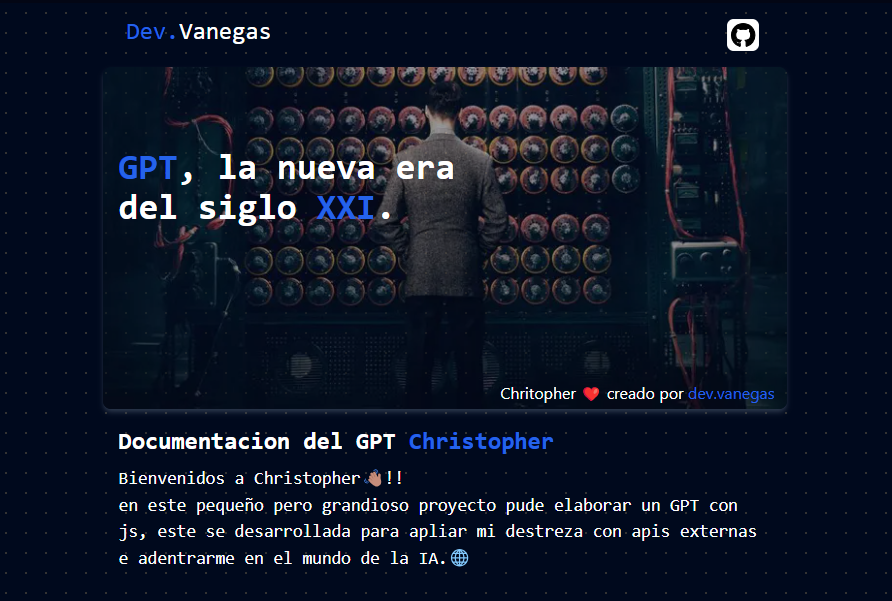

# GPT Christopher

> Christopher, software simulatorio de un Chat GPT "Generative Pretrained Transformer", desarrollado con html | css | js, para gestionar las tareas cotidianas que se me encargan en mi dia a dia.

> este en su principio se planeo para simular a ChatGPT, pero debido a la incompatibilidad que tiene la dependencia con el navegador no se pudo realizar, mas se esta trabajando en ello para asi dar el software por culminado.

